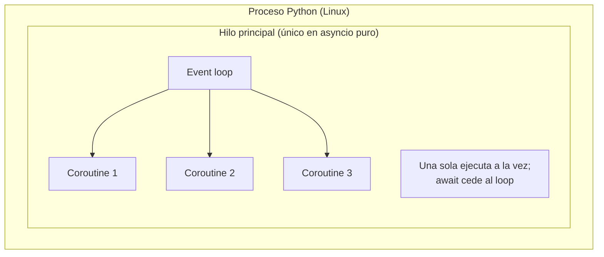
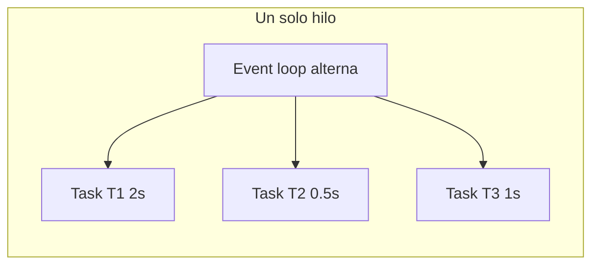
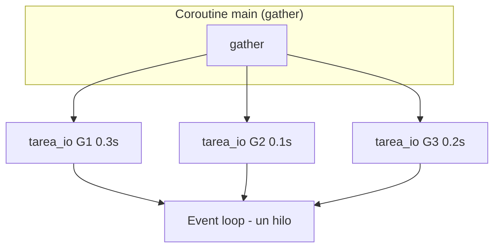

# 10 - Async/await básico — Mapas y diagramas

## Mapa: threads en CPython y el event loop (Linux)

En un proceso Python que **solo** usa asyncio (sin `run_in_executor` ni threading), hay **un único hilo de sistema (thread)**:

```
┌─────────────────────────────────────────────────────────────────────────┐
│  Proceso Python (un solo proceso en el SO)                              │
│  ┌────────────────────────────────────────────────────────────────────┐ │
│  │  Hilo principal (Main Thread) — el único hilo del proceso          │ │
│  │  ┌─────────────────────────────────────────────────────────────────┐ │
│  │  │  Event loop (asyncio)                                           │ │
│  │  │  • No es un thread separado: es lógica que corre en este hilo.  │ │
│  │  │  • Programa y ejecuta coroutines (tasks).                       │ │
│  │  │  • Cuando una coroutine hace await, el loop pasa a otra.        │ │
│  │  └─────────────────────────────────────────────────────────────────┘ │
│  │  • asyncio.run(main()) corre el event loop en este mismo hilo.     │ │
│  └────────────────────────────────────────────────────────────────────┘ │
└─────────────────────────────────────────────────────────────────────────┘
```

**Resumen:** El **event loop** no es un thread distinto. Es código que corre en el **mismo hilo** que tu programa; ese hilo ejecuta una coroutine hasta que hace `await`, entonces el loop elige otra coroutine y la ejecuta. Por eso asyncio es “concurrencia en un solo hilo”.

---

## Qué ocurre realmente en el intérprete (Linux)

1. **`asyncio.run(main())`**: crea un event loop, ejecuta `main()` como coroutine en el hilo actual y, cuando termina, cierra el loop.
2. **Coroutines**: son objetos (generadores mejorados); no son threads. Viven en el heap; el loop mantiene referencias a las Tasks.
3. **`await`**: cede el control al event loop. El loop guarda el estado de la coroutine y puede ejecutar otra; cuando el await “se resuelve” (p. ej. `asyncio.sleep` termina), el loop reanuda esa coroutine.
4. **Un solo hilo**: en ningún momento el SO ve varios threads para tus coroutines; todo pasa en el mismo thread, alternando qué coroutine está ejecutándose.

---

## Diagrama: Event loop vs threads de CPython (conceptual)



El event loop **es parte del hilo principal**, no un hilo aparte. Las coroutines se ejecutan una tras otra en ese mismo hilo cuando hacen `await`.

---

## Ejemplo: Coroutine simple (`ejemplo_coroutine_simple`)

`asyncio.run(tarea_io("A", 1.0))`: un solo hilo, una sola coroutine.

```mermaid
sequenceDiagram
    participant Main as Hilo principal
    participant Loop as Event loop
    participant Coro as tarea_io("A", 1.0)

    Main->>Loop: asyncio.run(tarea_io("A", 1.0))
    Loop->>Coro: ejecuta hasta await asyncio.sleep(1)
    Coro-->>Loop: await (cede control)
    Loop->>Loop: espera 1s (timer)
    Loop->>Coro: reanuda
    Coro-->>Loop: return "resultado-A"
    Loop-->>Main: devuelve resultado
```

---

## Ejemplo: Varias tareas (`ejemplo_varias_tareas`) — create_task

T1 (2s), T2 (0.5s), T3 (1s). Todas en el **mismo hilo**; el loop alterna.



**Línea de tiempo (simplificada):** el loop ejecuta un poco de T1 → await; un poco de T2 → await; T2 termina primero; luego T3; luego T1. Todo en el mismo thread.

---

## Ejemplo: gather (`ejemplo_gather`)

Tres coroutines (G1, G2, G3) con sleeps distintos; `gather` las programa todas y espera en orden de resultados.



El **mismo hilo** ejecuta G1, G2 y G3 por turnos cuando cada una hace `await asyncio.sleep(...)`.

---

## Ejemplo: Tres tareas concurrentes (`tres_tareas_concurrentes`)

Tres tareas de 0.2s cada una; en paralelo lógico (concurrentes) ≈ 0.2s total.

```mermaid
gantt
    title Mismo hilo: 3 tareas de 0.2s (concurrentes)
    dateFormat X
    axisFormat %L

    section Event loop
    trabajo_io(1) :a1, 0, 200
    trabajo_io(2) :a2, 0, 200
    trabajo_io(3) :a3, 0, 200
```



En la práctica el loop entrelaza ejecución: empieza las tres, cada una hace `await asyncio.sleep(0.2)`, el loop espera y reanuda; el tiempo total es ~0.2s, no 0.6s.
