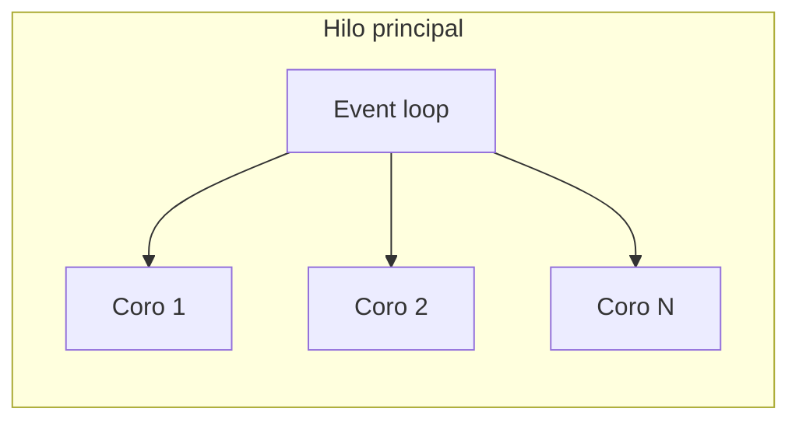
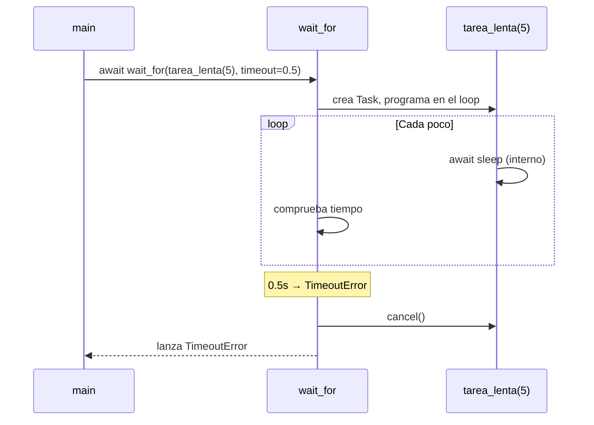
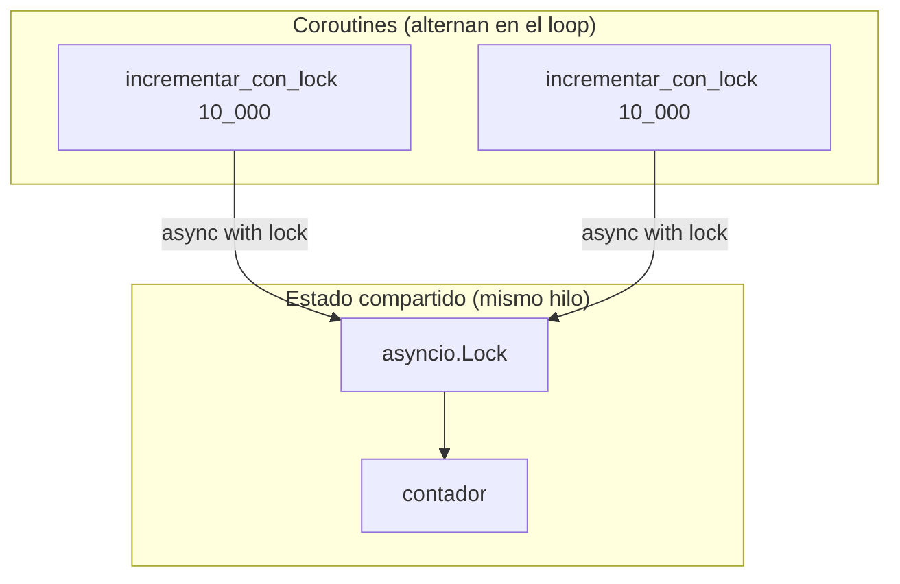
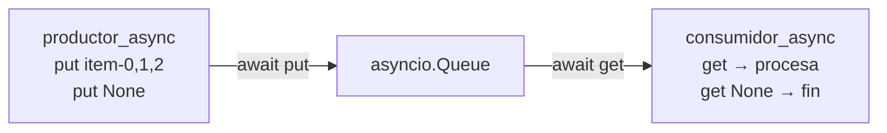
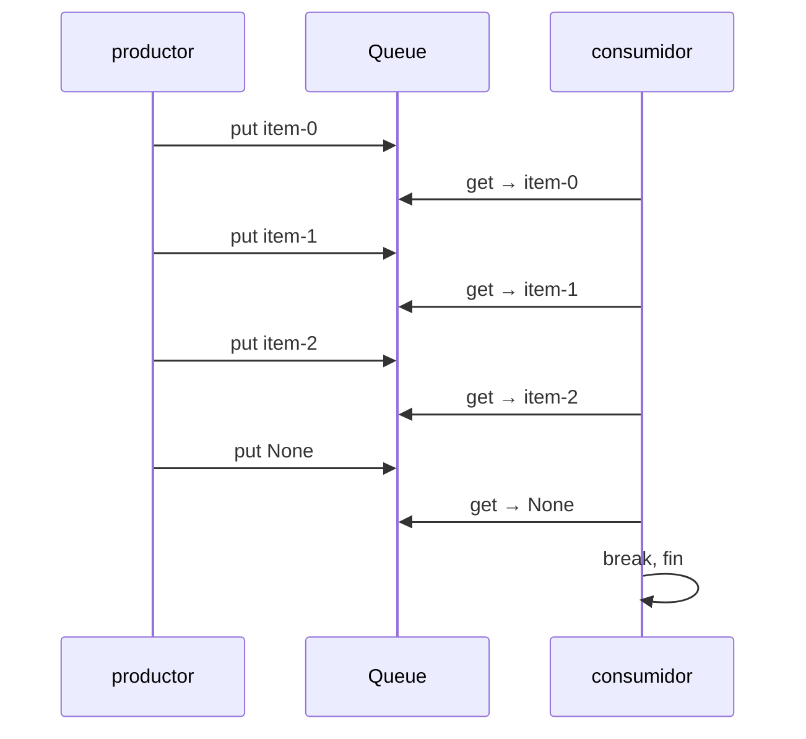
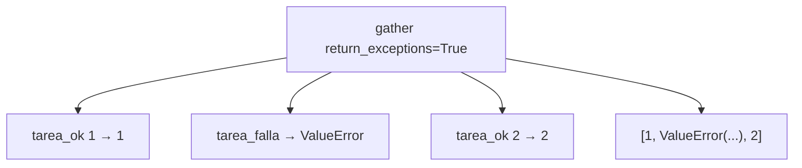
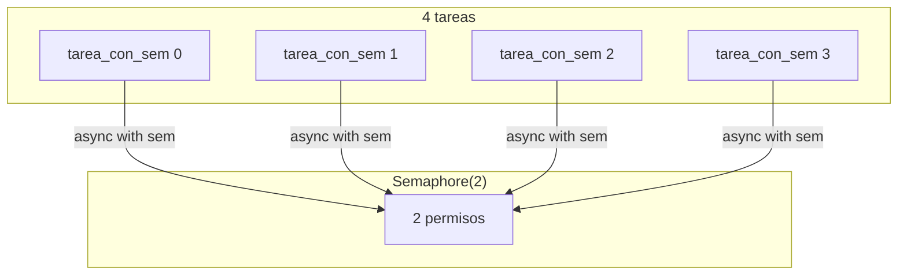

# 11 - Async/await medium — Mapas y diagramas

Todos los ejemplos corren en **un solo hilo**; el event loop programa las coroutines. Los diagramas muestran la interacción entre ellas.

---

## Contexto: un hilo, event loop

---

## Ejemplo: Timeout (`ejemplo_timeout`) — wait_for

`wait_for(tarea_lenta(5.0), timeout=0.5)`: la tarea quiere 5s; el timeout cancela a 0.5s.

La coroutine `tarea_lenta` se **cancela** cuando expira el timeout; el event loop sigue en el mismo hilo.

---

## Ejemplo: asyncio.Lock (`ejemplo_async_lock`)

Dos coroutines incrementan un contador compartido; el lock asegura que solo una modifica a la vez.

Solo una coroutine tiene el lock a la vez; la otra espera en `async with lock` (cede al loop sin bloquear el hilo).

---

## Ejemplo: asyncio.Queue (`ejemplo_async_queue`) — productor/consumidor

Un productor pone ítems; un consumidor los saca. Cola compartida, mismo hilo.

El event loop alterna entre productor y consumidor cuando hacen `await cola.put/get`.

---

## Ejemplo: gather con return_exceptions (`ejemplo_gather_exceptions`)

Tres tareas: una OK, una que lanza `ValueError`, otra OK. Con `return_exceptions=True` no se cancela el resto.

El resultado es una lista: posiciones 0 y 2 son valores; posición 1 es la excepción. Todo en el mismo hilo.

---

## Ejemplo: asyncio.Semaphore (`ejemplo_semaphore`)

Cuatro coroutines compiten por un semáforo(2): como máximo 2 dentro de la sección a la vez.

**Orden típico:** 0 y 1 entran; a 0.3s salen; entran 2 y 3; salen. El event loop despierta a las que esperan en `sem.acquire()` cuando hay permiso.
