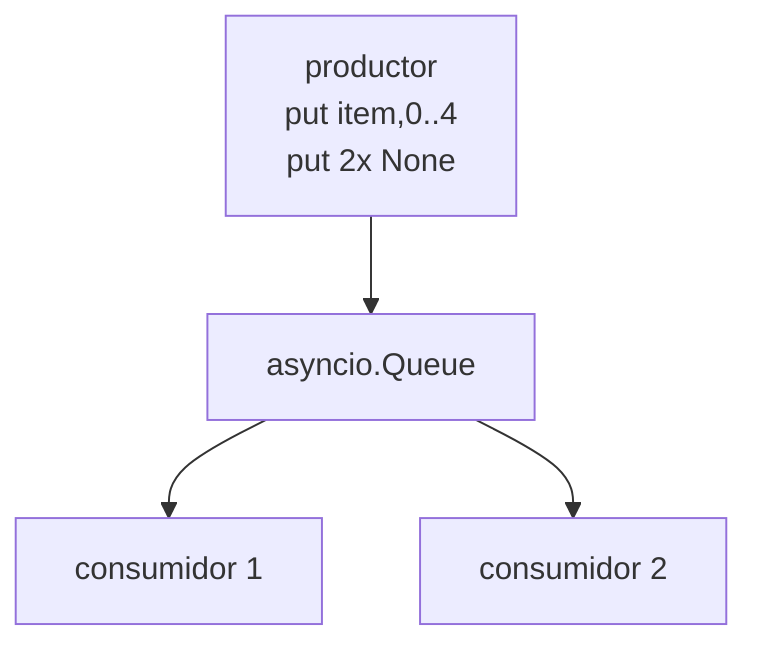
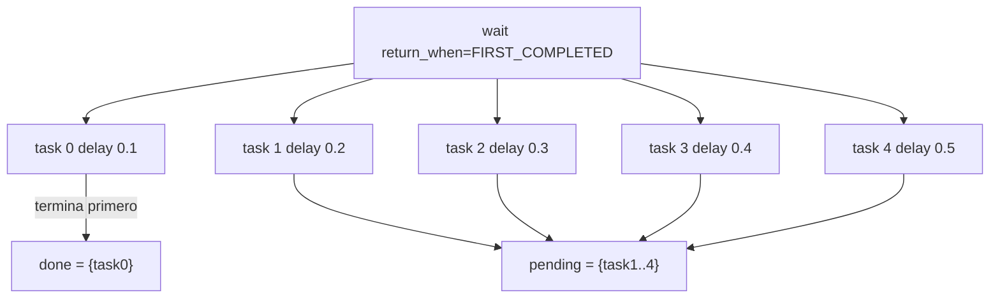

# 12 - Async/await avanzado — Mapas y diagramas

En este módulo aparece **más de un hilo**: el event loop sigue en el hilo principal, pero **run_in_executor** usa un pool de threads (p. ej. `ThreadPoolExecutor`). Los diagramas muestran esa mezcla.

---

## Mapa: hilos en CPython cuando usas run_in_executor (Linux)

```
┌─────────────────────────────────────────────────────────────────────────┐
│  Proceso Python                                                           │
│  ┌─────────────────────────────────────────────────────────────────────┐ │
│  │  Hilo principal                                                      │ │
│  │  • Event loop (asyncio)                                              │ │
│  │  • Coroutines (create_task, gather, await, etc.)                      │ │
│  └─────────────────────────────────────────────────────────────────────┘ │
│  ┌─────────────────────────────────────────────────────────────────────┐ │
│  │  ThreadPoolExecutor (workers) — creados por run_in_executor         │ │
│  │  • Worker 1: trabajo_cpu(10)                                         │ │
│  │  • Worker 2: trabajo_cpu(20)  …                                       │ │
│  └─────────────────────────────────────────────────────────────────────┘ │
└─────────────────────────────────────────────────────────────────────────┘
```

El **event loop** corre en el hilo principal. Las funciones bloqueantes (p. ej. `trabajo_cpu`) se ejecutan en **otros hilos** del pool; cuando terminan, el resultado se devuelve al loop y la coroutine que hizo `await run_in_executor(...)` se reanuda.

---

## Diagrama: Event loop + executor (conceptual)

```mermaid
flowchart TB
    subgraph MainThread["Hilo principal"]
        EL[Event loop]
        Coro[Coroutine que hace\nawait run_in_executor(...)]
        EL --> Coro
    end

    subgraph Pool["ThreadPoolExecutor"]
        W1[Worker 1]
        W2[Worker 2]
    end

    Coro -->|submit trabajo_cpu| Pool
    Pool -->|Future completado| EL
    EL --> Coro
```

---

## Ejemplo: run_in_executor (`ejemplo_run_in_executor`)

Una coroutine delega `trabajo_cpu(100)` a un worker del pool por defecto; el hilo principal no se bloquea.

```mermaid
sequenceDiagram
    participant Coro as Coroutine
    participant Loop as Event loop
    participant Pool as ThreadPool (default)
    participant W as Worker thread

    Coro->>Loop: await run_in_executor(None, trabajo_cpu, 100)
    Loop->>Pool: submit(trabajo_cpu, 100)
    Pool->>W: ejecuta trabajo_cpu(100)
    Note over Coro: cede; loop puede ejecutar otras coroutines
    W-->>Loop: Future.set_result(5050)
    Loop->>Coro: reanuda con resultado 5050
```

---

## Ejemplo: Executor explícito (`ejemplo_executor_explicito`)

Mismo flujo pero con un `ThreadPoolExecutor(max_workers=2)` pasado explícitamente.

```mermaid
flowchart LR
    Loop[Event loop\nhilo principal]
    Pool[ThreadPoolExecutor\nmax_workers=2]
    Loop -->|run_in_executor(pool, ...)| Pool
    Pool --> W1[Worker 1: trabajo_cpu 50]
    Pool --> W2[Worker 2: trabajo_cpu 100]
    W1 & W2 --> Result[resultados]
```

---

## Ejemplo: Varias tareas en executor (`ejemplo_varios_executor`)

Tres llamadas a `run_in_executor` en paralelo: hasta tres workers pueden estar ocupados a la vez.

```mermaid
gantt
    title run_in_executor: 3 tareas en paralelo (varios threads)
    dateFormat X
    axisFormat %L

    section Hilo principal
    Event loop (espera gather) :loop, 0, 100

    section Workers
    trabajo_cpu(10)  :w1, 0, 100
    trabajo_cpu(20)  :w2, 0, 100
    trabajo_cpu(30)  :w3, 0, 100
```



El tiempo total ≈ 0.1s (una tarea) en lugar de 0.3s, porque se ejecutan en threads distintos.

---

## Ejemplo: Producer-consumer con varios consumidores (`ejemplo_producer_consumer_multi`)

Un productor, dos consumidores, una cola; todo en el **mismo hilo** (solo asyncio.Queue, sin executor).



El event loop alterna entre productor y consumidores cuando hacen `await cola.put/get`.

---

## Ejemplo: Cancelación (`ejemplo_cancelacion`)

`create_task(tarea_cancelable(10))` → a los 0.1s se llama `task.cancel()`.

```mermaid
sequenceDiagram
    participant Main as main
    participant Loop as Event loop
    participant Task as tarea_cancelable(10)

    Main->>Loop: t = create_task(tarea_cancelable(10))
    Loop->>Task: ejecuta hasta await sleep(10)
    Task-->>Loop: await (cede)
    Main->>Loop: await sleep(0.1)
    Main->>Task: t.cancel()
    Loop->>Task: CancelledError
    Task->>Task: except CancelledError, raise
    Task-->>Main: CancelledError
```

La tarea puede hacer cleanup en `except asyncio.CancelledError` y luego re-lanzar.

---

## Ejemplo: asyncio.wait FIRST_COMPLETED (`ejemplo_wait_first_completed`)

Cinco tareas con delays distintos; se espera solo al **primero** que termine.



Luego el código cancela las `pending` y hace `gather(..., return_exceptions=True)` para limpiar. Todo en un solo hilo salvo si alguna tarea usara `run_in_executor`.
