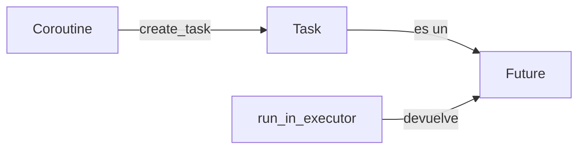

# Consolidación: Coroutine, Task y Future (event loop)

Documento de referencia para afianzar los tres conceptos centrales del event loop de asyncio: **Coroutine**, **Task** y **Future**. Incluye definiciones breves, ejemplos mínimos ejecutables y su relación. Solo biblioteca estándar (asyncio), Python 3.10+.

---

## 1. Introducción

El **event loop** de asyncio corre en una sola hebra: programa y ejecuta coroutines, y cuando una hace `await`, el loop puede pasar a otra. Los objetos con los que trabajas son **Coroutine** (el trabajo a ejecutar), **Task** (coroutine programada en el loop) y **Future** (promesa de un resultado futuro). Este documento consolida qué es cada uno y cómo se relacionan.

**Alcance:** asyncio (stdlib), Python 3.10+. No se cubren librerías externas.

---

## 2. Coroutine

**Definición:** Una coroutine es una función definida con `async def`. Al llamarla (sin usar `await` todavía) obtienes un **objeto coroutine**; en ese momento aún no se ejecuta. La ejecución ocurre cuando el event loop la ejecuta, por ejemplo al hacer `await coro()` o al pasarla a `create_task()` o `gather()`.

**Ejemplo mínimo (ejecutable):**

```python
import asyncio

async def mi_coroutine():
    await asyncio.sleep(0.1)
    return 42

# Llamar mi_coroutine() solo crea el objeto coroutine; no ejecuta el cuerpo
obj = mi_coroutine()
print(type(obj))  # <class 'coroutine'>

# asyncio.run() crea el loop, ejecuta la coroutine y devuelve el resultado
resultado = asyncio.run(mi_coroutine())
print(resultado)  # 42
```

**Referencia en el curso:** [10_async_basico.py](10_async_basico.py) — `ejemplo_coroutine_simple`, función `tarea_io`.

---

## 3. Task

**Definición:** Una **Task** es una coroutine que ya está programada en el event loop. Se crea con `asyncio.create_task(coro())`. La Task es un tipo de **Future**: cuando la coroutine termina, el Future se completa con el resultado (o con la excepción). Así puedes ejecutar varias coroutines “a la vez” (concurrencia cooperativa) y esperar sus resultados con `await task`.

**Ejemplo mínimo (ejecutable):**

```python
import asyncio

async def trabajo(n: int):
    await asyncio.sleep(0.05 * n)
    return n * 2

async def main():
    t = asyncio.create_task(trabajo(21))
    print(type(t))       # <class 'asyncio.Task'>
    print(t.done())      # False (aún no termina)
    r = await t
    print(r)             # 42
    print(t.done())      # True

asyncio.run(main())
```

**Referencia en el curso:** [10_async_basico.py](10_async_basico.py) — `ejemplo_varias_tareas`; [14_future_profundizacion.py](14_future_profundizacion.py) — `ejemplo_task_es_future`.

---

## 4. Future

**Definición:** Un **Future** (en asyncio) es un objeto que representa un resultado (o una excepción) que estará disponible más tarde. Es **awaitable**: puedes hacer `await future` y la coroutine actual se suspenderá hasta que el Future se complete. En asyncio, **Task es una subclase de Future** (una Task es un Future completado por la coroutine que envuelve). Un Future “desnudo” se crea con `loop.create_future()` y se completa con `future.set_result()` o `future.set_exception()`; `run_in_executor()` devuelve un Future que el loop completa cuando el executor termina.

**Ejemplo mínimo A — Future manual (ejecutable):**

```python
import asyncio

async def main():
    loop = asyncio.get_running_loop()
    fut = loop.create_future()

    async def completar():
        await asyncio.sleep(0.2)
        fut.set_result(100)

    asyncio.create_task(completar())
    r = await fut
    print(r)  # 100

asyncio.run(main())
```

**Ejemplo mínimo B — Future desde run_in_executor (ejecutable):**

```python
import asyncio
import time

def trabajo_sync(x: int):
    time.sleep(0.2)
    return x * 10

async def main():
    loop = asyncio.get_running_loop()
    # run_in_executor devuelve un Future (no es una Task)
    fut = loop.run_in_executor(None, trabajo_sync, 5)
    print(type(fut))  # <class 'asyncio.Future'> (o _Future...)
    r = await fut
    print(r)  # 50

asyncio.run(main())
```

**Referencia en el curso:** [14_future_profundizacion.py](14_future_profundizacion.py) — `ejemplo_asyncio_future_manual`, `ejemplo_task_es_future`; [12_async_advanced.py](12_async_advanced.py) — `run_in_executor`.

---

## 5. Relación entre los tres



- **Coroutine:** el “trabajo” (función `async def`). Al programarla con `create_task(coro())` obtienes una **Task**.
- **Task:** es un **Future**; cuando la coroutine termina, el Future se completa con el resultado.
- **Future:** promesa de resultado. Puede ser una **Task** (coroutine programada) o el objeto devuelto por **run_in_executor** (trabajo en otro hilo o proceso).

**Resumen:** Coroutine = qué se ejecuta; Task = coroutine programada en el loop (y es un Future); Future = resultado futuro, ya sea una Task o el resultado del executor.

---

## 6. Tabla resumen

| Concepto   | Qué es                                      | Cómo se crea                                      | Cómo se obtiene el resultado        |
|------------|---------------------------------------------|---------------------------------------------------|--------------------------------------|
| Coroutine  | Función async; objeto awaitable              | `async def` + llamada (p. ej. `mi_coro()`)        | `await coro()` o programar con `create_task` |
| Task       | Coroutine programada; subclase de Future     | `asyncio.create_task(coro())`                     | `await task` o `task.result()` si ya está done |
| Future     | Promesa de resultado (awaitable)             | `loop.create_future()`, `run_in_executor(...)`, o `create_task` | `await future` o `future.result()` si done |

---

## 7. Enlaces a módulos del curso

- **[10_async_basico.py](10_async_basico.py):** coroutines (`tarea_io`), `asyncio.run()`, `create_task`, `gather`.
- **[12_async_advanced.py](12_async_advanced.py):** `run_in_executor` (Future que viene del executor).
- **[14_future_profundizacion.py](14_future_profundizacion.py):** `asyncio.Future` manual (`create_future`, `set_result`), Task como Future, `gather`, `as_completed`, `wait_for`.

Este documento complementa los módulos anteriores como material de consolidación para estudiar Coroutine, Task y Future en el event loop.
