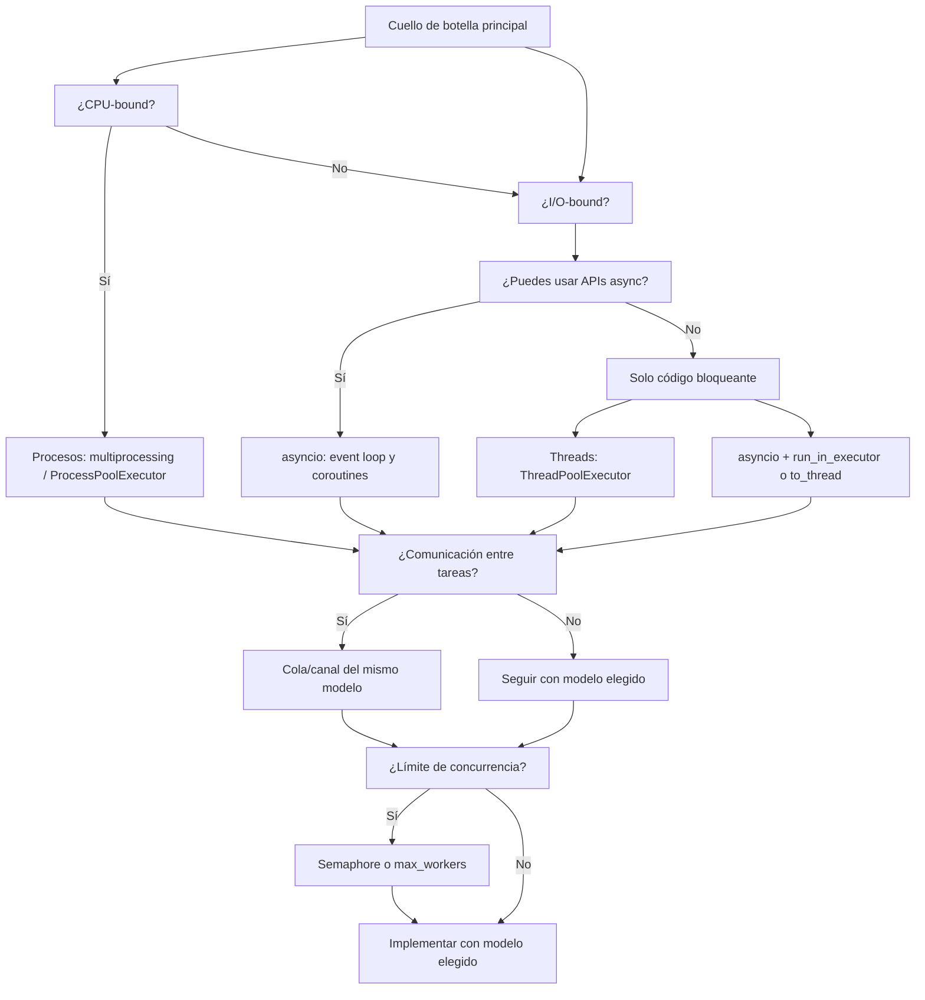

# Guía técnica: concurrencia y paralelismo en Python (stdlib)

Documento técnico de referencia para elegir modelo y librerías nativas de concurrencia y paralelismo: árbol de decisión, APIs de la biblioteca estándar, buenas prácticas y limitaciones conocidas.

**Alcance:** solo biblioteca estándar de Python; Python 3.10+. Sin APIs deprecadas. Para clasificación detallada de modelos y estructuras de datos, ver [MAPA_CONCURRENCIA_PARALELISMO.md](MAPA_CONCURRENCIA_PARALELISMO.md). Para alto/bajo nivel en asyncio, ver [MAPA_ASYNC_ALTO_BAJO_NIVEL.md](MAPA_ASYNC_ALTO_BAJO_NIVEL.md).

---

## 1. Alcance y convenciones

- **Librerías:** `threading`, `queue`, `multiprocessing`, `concurrent.futures`, `asyncio`. No se cubren librerías externas ni APIs en desuso (p. ej. `asyncio.get_event_loop()` sin `run()`).
- **Módulos del curso:** se referencian por número y nombre (p. ej. `08_concurrent_futures.py`, `12_async_advanced.py`) como ejemplos ejecutables; esta guía es la brújula, los `.py` la práctica.
- **Términos:** *concurrencia* = varias tareas en progreso (pueden alternar); *paralelismo* = ejecución simultánea en varios núcleos (en Python, vía procesos).

---

## 2. Conceptos base

### 2.1 GIL (Global Interpreter Lock)

En **CPython**, un solo hilo ejecuta bytecode Python a la vez por proceso. Consecuencias:

- **Threads:** no dan paralelismo de CPU puro; sí concurrencia (mientras un thread espera I/O, otro puede ejecutar). Adecuados para I/O-bound.
- **Procesos:** cada proceso tiene su propio intérprete y su propio GIL; varios procesos sí ejecutan en paralelo en varios núcleos. Adecuados para CPU-bound.

### 2.2 I/O-bound vs CPU-bound

- **I/O-bound:** el tiempo se va en esperas (red, disco, APIs). Aumentar núcleos no acelera; conviene concurrencia (threads o asyncio) o paralelismo solo si hay mucho I/O paralelizable.
- **CPU-bound:** el tiempo se va en cómputo (cálculos, procesamiento). Para acelerar, hace falta paralelismo real: **procesos** (multiprocessing / ProcessPoolExecutor).

Este criterio es el principal para el árbol de decisión.

### 2.3 Concurrencia vs paralelismo

- **Concurrencia:** varias tareas “en curso”; pueden turnarse en una CPU (threads, coroutines) o ejecutarse a la vez en varias CPUs.
- **Paralelismo:** ejecución simultánea en más de un núcleo. En Python con stdlib, solo se obtiene con **procesos** (o código que libere el GIL, p. ej. extensiones C).

---

## 3. Árbol de decisión

### 3.1 Diagrama (Mermaid)

### 3.2 Árbol en texto (referencia rápida)

1. **¿El cuello de botella es CPU (cálculos pesados)?**
   - **Sí** → Usar **procesos**: `multiprocessing` o `concurrent.futures.ProcessPoolExecutor`. Comunicación: `multiprocessing.Queue`, `Pipe`, `Value`/`Array` o `Manager`.
   - **No** → Seguir al paso 2.

2. **¿El cuello de botella es I/O (red, disco, esperas)?**
   - **¿Puedes usar APIs async (p. ej. aiohttp, drivers async)?**
     - **Sí** → Usar **asyncio**: `asyncio.run()`, coroutines, `create_task`, `gather`. Un solo hilo, muchas tareas cooperativas.
     - **No** (solo librerías síncronas) → Usar **threads** (`ThreadPoolExecutor`) o **asyncio + run_in_executor / asyncio.to_thread** para no bloquear el event loop.

3. **¿Necesitas comunicación entre tareas?**
   - **Threads:** `queue.Queue` (y variantes).
   - **Procesos:** `multiprocessing.Queue`, `Pipe`, o `Manager` para estructuras compartidas.
   - **Asyncio:** `asyncio.Queue`. No usar `queue.Queue` para coordinar coroutines.

4. **¿Necesitas límite de concurrencia (rate limit, N conexiones simultáneas)?**
   - **Threads / asyncio:** `threading.Semaphore` o `asyncio.Semaphore`; o limitar por `max_workers` del pool.
   - **Procesos:** `multiprocessing.Semaphore` si aplica; a menudo el límite viene del tamaño del pool.

---

## 4. Librerías nativas por modelo

### 4.1 threading

| Componente | Uso |
|------------|-----|
| `threading.Thread` | Crear y arrancar un hilo (`start()`, `join()`). |
| `threading.Lock`, `RLock` | Exclusión mutua (una sección crítica a la vez). |
| `threading.Event` | Señal uno-a-muchos (wait/set). |
| `threading.Condition` | Wait/notify con condición. |
| `threading.Semaphore`, `BoundedSemaphore` | Límite de N hilos en una sección. |

**Casos de uso típicos:** I/O-bound con código síncrono; worker pools; integración con librerías bloqueantes.

**Cuándo no usarlo:** CPU-bound (usar procesos); cuando puedas expresar todo con asyncio y APIs async (menos overhead).

**Módulos del curso:** 04_threading_basico.py, 05_sincronizacion.py, 06_comunicacion_threads.py, 13_semaphore_profundizacion.py.

### 4.2 queue

| Componente | Uso |
|-----------|-----|
| `queue.Queue` | Cola FIFO thread-safe; `put()`/`get()` bloquean. |
| `queue.LifoQueue`, `PriorityQueue` | Colas con otra política. |

**Casos de uso típicos:** producer-consumer entre threads; pasar trabajo o resultados entre hilos.

**Cuándo no usarlo:** Entre procesos (usar `multiprocessing.Queue`); entre coroutines (usar `asyncio.Queue`).

**Módulos del curso:** 06_comunicacion_threads.py, 09_practica_integrada.py.

### 4.3 multiprocessing

| Componente | Uso |
|------------|-----|
| `multiprocessing.Process` | Crear y arrancar un proceso. |
| `multiprocessing.Queue` | Cola entre procesos (serialización automática). |
| `multiprocessing.Pipe` | Canal punto a punto. |
| `multiprocessing.Value`, `Array` | Memoria compartida (tipos C). |
| `multiprocessing.Manager` | Objetos compartidos (list, dict, etc.) vía proxy. |
| `multiprocessing.Lock`, `Event`, `Condition`, `Semaphore` | Sincronización entre procesos. |

**Casos de uso típicos:** CPU-bound; aprovechar varios núcleos; aislamiento (un fallo no tumba todo el proceso).

**Cuándo no usarlo:** I/O-bound puro (overhead de procesos; preferir threads o asyncio). Datos no serializables (pickle) no pueden pasarse entre procesos.

**Módulos del curso:** 07_multiprocessing.py.

### 4.4 concurrent.futures

| Componente | Uso |
|------------|-----|
| `ThreadPoolExecutor` | Pool de threads; `submit(fn, *args)`, `map(fn, iterable)`; devuelve `Future`. |
| `ProcessPoolExecutor` | Pool de procesos; misma API. |
| `Future` | Promesa de resultado; `result(timeout=...)`, `done()`, `cancel()`. |
| `as_completed(futures)`, `wait(futures)` | Esperar a varios futures. |

**Casos de uso típicos:** “Ejecutar muchas tareas, máximo N a la vez” sin gestionar Thread/Process a mano; integrar con asyncio vía `run_in_executor`.

**Cuándo no usarlo:** Si todo es async y no hay código bloqueante, el event loop solo suele ser más eficiente que añadir un ThreadPoolExecutor.

**Módulos del curso:** 08_concurrent_futures.py, 14_future_profundizacion.py.

### 4.5 asyncio

| Componente | Uso |
|------------|-----|
| `asyncio.run(coro)` | Punto de entrada; crea loop, ejecuta coroutine, cierra. |
| `async def`, `await` | Definir y esperar coroutines. |
| `asyncio.create_task(coro)` | Programar coroutine en el loop (no crea thread). |
| `asyncio.gather()`, `asyncio.wait()` | Ejecutar/esperar varias coroutines. |
| `asyncio.wait_for(coro, timeout=...)` | Timeout; cancela si expira. |
| `asyncio.Queue`, `Lock`, `Semaphore`, `Event`, `Condition` | Comunicación y sincronización entre coroutines. |
| `loop.run_in_executor(executor, fn, *args)` | Ejecutar función bloqueante o CPU en pool; `await` al resultado. |
| `asyncio.to_thread(fn, *args)` | Atajo para ejecutar función bloqueante en thread (Python 3.9+). |

**Casos de uso típicos:** I/O-bound con muchas conexiones/esperas; servidores; mezcla con `run_in_executor`/`to_thread` para código bloqueante o con ProcessPoolExecutor para CPU-bound.

**Cuándo no usarlo:** Si todo tu código es síncrono y no quieres tocar asyncio, ThreadPoolExecutor puede bastar. No uses primitivas de threading (Lock, etc.) para coordinar coroutines; usa las de asyncio.

**Módulos del curso:** 10_async_basico.py, 11_async_medium.py, 12_async_advanced.py, 13_semaphore_profundizacion.py (ejemplos async), 14_future_profundizacion.py.

---

## 5. Buenas prácticas

### 5.1 Threading

- **Locks:** Usar `with lock:` (o `try`/`finally` con `release()`) para garantizar liberación incluso ante excepciones. Evitar `acquire()` sin `release()` en una rama.
- **Estado compartido:** No dejar variables globales o atributos compartidos sin protección (Lock, cola, etc.); riesgo de race conditions.
- **Timeouts:** Usar `join(timeout=...)`, `Lock.acquire(timeout=...)`, `Queue.get(timeout=...)` cuando sea razonable para evitar bloqueos indefinidos.
- **Daemon:** Marcar threads como `daemon=True` solo cuando el proceso no deba esperar a que terminen (p. ej. monitores); no hacer `join()` de daemons si se espera limpieza ordenada.

### 5.2 Multiprocessing

- **Serialización:** Argumentos y resultados de procesos deben ser serializables (pickle). No pasar conexiones de red, file handles ni objetos no picklables.
- **Ciclo de vida:** Usar `with ProcessPoolExecutor(...) as executor` o llamar a `shutdown()`; o `Process.join()` si creas procesos a mano. Evitar dejar procesos huérfanos.
- **Compartir estado:** Para datos compartidos usar `multiprocessing.Queue`, `Pipe`, `Value`/`Array` o `Manager`; no asumir memoria compartida arbitraria entre procesos.

### 5.3 Asyncio

- **No bloquear el loop:** No usar `time.sleep()` ni llamadas bloqueantes dentro de una coroutine; usar `await asyncio.sleep()` y para I/O o CPU bloqueante usar `run_in_executor()` o `asyncio.to_thread()`.
- **Punto de entrada:** Una coroutine principal y `asyncio.run(main())`; no mezclar múltiples loops en el mismo hilo ni llamar a `run()` anidado.
- **Primitivas:** Usar solo primitivas asyncio (`asyncio.Lock`, `asyncio.Semaphore`, etc.) para coordinar coroutines; no usar `threading.Lock` dentro de coroutines para ese fin.
- **Cancelación:** Las tareas canceladas reciben `CancelledError` en el siguiente `await`; manejarla si necesitas limpieza.

### 5.4 Futures y ejecutores

- **Cierre del executor:** Usar `with ThreadPoolExecutor(...) as executor` o `executor.shutdown()` para no dejar threads colgados.
- **Resultados y timeouts:** Usar `future.result(timeout=...)` o `as_completed()` para no bloquear indefinidamente; capturar `TimeoutError`/`concurrent.futures.TimeoutError`.
- **Con asyncio:** Usar `await loop.run_in_executor(executor, fn, *args)` para trabajo bloqueante; no llamar a `future.result()` bloqueante desde una coroutine sin necesidad.

---

## 6. Limitaciones conocidas

### 6.1 GIL

- Los **threads** no proporcionan paralelismo de CPU en CPython; solo un hilo ejecuta bytecode a la vez. Para CPU-bound usar **procesos** (o código que libere el GIL, p. ej. NumPy en operaciones que lo hagan).

### 6.2 Multiprocessing

- **Pickle:** Todo lo que se pase a un proceso (argumentos, resultados, objetos en Queue) debe ser serializable. Lambdas, funciones locales, objetos con estado no serializable (handles, conexiones) no pueden pasarse directamente.
- **Overhead:** Crear procesos y comunicar entre ellos tiene coste; para tareas muy pequeñas puede no compensar.
- **Memoria:** Cada proceso tiene su espacio de memoria; no se comparte memoria arbitraria sin `Value`/`Array`/`Manager`.

### 6.3 Asyncio

- **Un loop por hilo:** En un mismo hilo solo puede estar corriendo un event loop a la vez. Múltiples loops en paralelo requieren múltiples hilos (uno por loop).
- **Código bloqueante:** Cualquier llamada bloqueante dentro de una coroutine bloquea todo el event loop; hay que delegarla a `run_in_executor` o `to_thread`.
- **Primitivas distintas:** `asyncio.Lock`/`Semaphore`/`Event` no son intercambiables con los de `threading`; usar siempre las del modelo en el que corre el código.

### 6.4 ThreadPoolExecutor y run_in_executor / to_thread

- **ThreadPoolExecutor:** Tiene un número máximo de workers; si todo el trabajo puede ser async, el event loop solo suele ser más eficiente (sin overhead de threads).
- **to_thread:** Atajo para ejecutar una función en un thread del pool por defecto; equivalente a `run_in_executor(None, fn, *args)`. Solo threads, no procesos.
- **run_in_executor:** Permite pasar un `ProcessPoolExecutor` para trabajo CPU-bound desde asyncio; `to_thread` no cubre ese caso.

### 6.5 Otras

- **Daemon threads:** Terminan con el proceso sin garantía de limpieza; no usar para tareas que deban completar o liberar recursos de forma ordenada.
- **Queue.get() sin timeout:** Puede bloquear indefinidamente si no llegan ítems; usar `get(timeout=...)` o mecanismos de cierre (sentinela, Event).
- **Cancelación en asyncio:** `task.cancel()` hace que la coroutine reciba `CancelledError`; si la capturas, re-lanzarla o asegurar que la tarea termina de forma coherente.

---

## 7. Tabla resumen y referencias

### 7.1 Si tu caso es X → modelo Y → librerías Z

| Caso | Modelo | Módulos stdlib | Ejemplos curso |
|------|--------|----------------|----------------|
| CPU-bound (cálculos) | Procesos | multiprocessing, concurrent.futures | 07, 08, 14 |
| I/O-bound, APIs async | Asyncio | asyncio | 10, 11, 12 |
| I/O-bound, solo bloqueante | Threads o asyncio+executor | threading, queue, concurrent.futures, asyncio | 04–06, 08, 12, 14 |
| Comunicación entre threads | Threads | queue | 06, 09 |
| Comunicación entre procesos | Procesos | multiprocessing.Queue, Pipe, Manager | 07 |
| Comunicación entre coroutines | Asyncio | asyncio.Queue | 11, 12 |
| Límite de concurrencia | Cualquiera | Semaphore (mismo modelo) o max_workers | 11, 13 |
| Pool “N tareas a la vez” | Threads o procesos | ThreadPoolExecutor, ProcessPoolExecutor | 08, 13, 14 |
| Integrar bloqueante en async | Asyncio + ejecutor | asyncio.run_in_executor, asyncio.to_thread | 12 |

### 7.2 Documentos y módulos del curso

- [MAPA_CONCURRENCIA_PARALELISMO.md](MAPA_CONCURRENCIA_PARALELISMO.md): modelos, librerías por tipo, comunicación segura, sincronización, casos de uso.
- [MAPA_ASYNC_ALTO_BAJO_NIVEL.md](MAPA_ASYNC_ALTO_BAJO_NIVEL.md): APIs alto nivel vs bajo nivel en asyncio.
- Módulos ejecutables: 03 (conceptos), 04–06 (threads), 07 (procesos), 08 y 14 (futures), 09 (práctica integrada), 10–12 (asyncio), 13 (Semaphore), 14 (Future).

Esta guía complementa los mapas y los módulos `.py` del curso como documento técnico de referencia para la decisión y el uso correcto de las librerías nativas.
